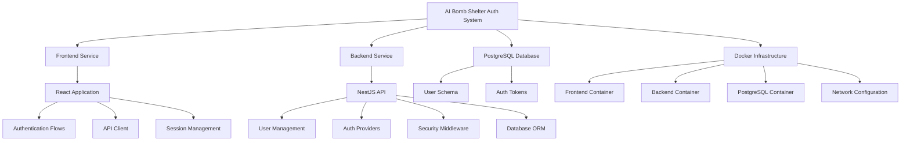
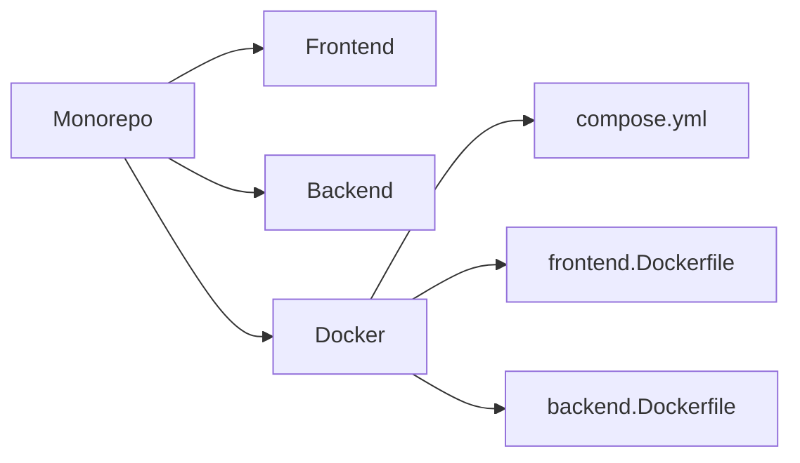
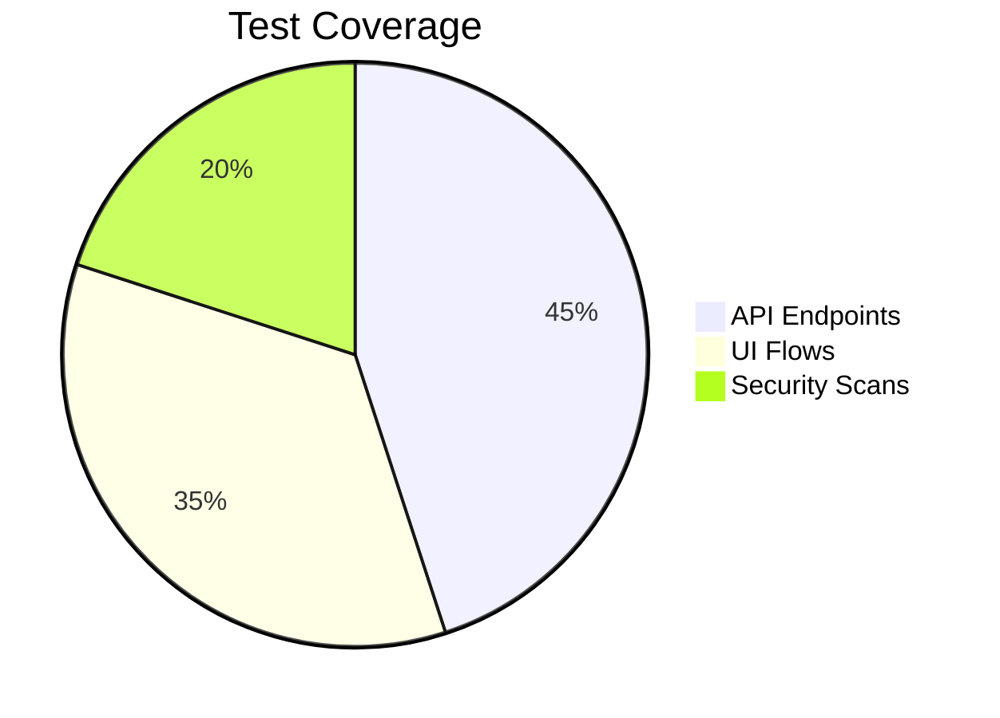
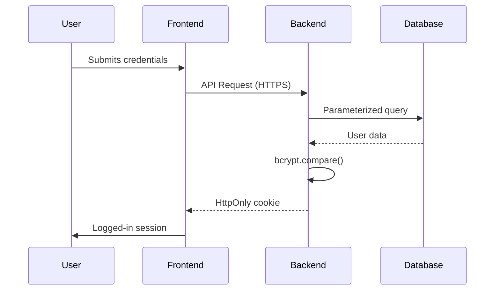

# AI Bomb Shelter Authentication System Implementation Plan

## Project Overview
Full-stack Dockerized authentication system with:
- React frontend
- NestJS backend
- PostgreSQL database
- Docker infrastructure
- SSO integration (Google/Microsoft365/Facebook mock)
- 2FA/TOTP implementation
- Password reset flows

## System Architecture


## Implementation Roadmap

### 1. Core Infrastructure Setup (Days 1-2)


### 2. Backend Implementation
**Auth Core (Days 3-5):**
- User model with Sequelize
- Password hashing (bcrypt)
- JWT session management
- Rate limiting middleware

**SSO Integration (Days 6-8):**
- Passport.js mock strategies
- Token validation workflows
- User reconciliation logic

**Security Infrastructure (Days 9-10):**
- Request validation pipeline
- Security headers (Helmet.js)
- CSP management

### 3. Frontend Implementation (Days 3-10)
- Auth components with Formik
- SSO provider button system
- 2FA workflow (QR code scanner)
- Error handling context

### 4. Testing & Verification (Days 11-12)


## Security Implementation


## Docker Strategy
```yaml
# docker-compose.yml
services:
  frontend:
    build: ./frontend
    ports: ["3000:3000"]
  backend: 
    build: ./backend
    environment:
      - DB_HOST=postgres
    depends_on: 
      - postgres
  postgres:
    image: postgres:15
    volumes:
      - pgdata:/var/lib/postgresql/data
```

## Key Decisions
1. **JWT Implementation**: Access tokens (30min) + refresh tokens (7d)
2. **Mock Services**:
   - SSO: Local OAuth2 mock server
   - Email: Console logging with message preview
3. **Security Defaults**:
   - Password complexity: 12+ chars, 1+ special
   - Rate limits: 5/min per endpoint